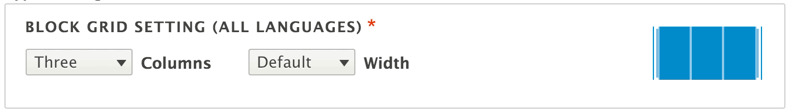

# block_grid_field

Drupal 8 module. Special Dropdown Combination to indicate a block grid layout.

# Usage

After install you will find a new field Type. Use as desired.
Go to the settings page `/admin/config/content/block_grid_field` and edit.

# Srceen

When placed into a field it looks like this:

# Credits

code base: [github.com/WondrousLLC/block_grid_field](https://github.com/WondrousLLC/block_grid_field/)

developed by [WONDROUS LLC](https://www.wearewondrous.com/)
